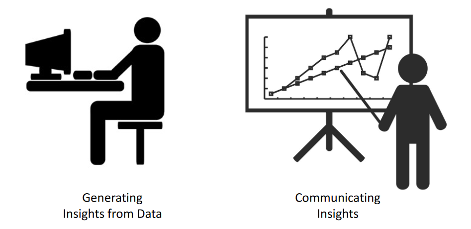

# Business Intelligence

## Team
Artur Erfurt\
Patrick Jäckle\
Nicolas Mahn\
Kevin Hilzinger\
Jan-Hendrik Hauser\
Niko Kauz

## Skills of a Data Scientist

## Bewertung
- Läuft der Code auf dem Zielsystem?
- Ist der Code nachvollziehbar strukturiert?
- Liefert der Code die korrekten Ergebnisse (bzw. ist die implementierte Logik korrekt)?
- Ist der Code effizient (in Bezug auf
  Ressourcennutzung)
- Ist die Ausgabe des Codes gut benutzbar (die
  notwendigen Erkenntnisse gut abzuleiten)

## Anforderung an die Präsentationen
- Präsentationsdauer
- Min 10 min und max5 min pro Person(wird ggf. noch verlängert)
- Gruppengröße max 6. (bei Felix eintragen)
- Einzelbewertung möglich: im Vorfeld dazu melden
- Durch die Analysen gewonnene Erkenntnisse werden vorgestellt und interpretiert
- Fiktive Zielgruppe: Vorstand (CEO/CTO) von E-above
- --> Implikation auf das Geschäft von E-Above berücksichtigen 
- Implementierte Lösung wird erläutert und ggf. demonstriert
- Fiktive Zielgruppe CTO/BI-Abteilung von E-above
- Technische Konzepte der Lösung werden erläutert
- Z.B. Architekturdiagramme, Algorithmen
- Fiktive Zielgruppe BI-Abteilung E-above
- Code+Folienabgeben
- Timing!
- Abdeckung der geforderten Inhalte
- Inhaltliche Reflektion der Ergebnisse
- Welchen Nutzen bringt die Auswertung bzw. was kann durch die Auswertung an Erkenntnissen gewonnen werden?
- Warum wurde die Lösung technische so und nicht anders umgesetzt?
- Was ließe sich noch Verbessern?
- Anschaulichkeit (für die jeweilige Zielgruppe)
- Vortragsstil
- Diskussion

# Aufgabe 1

## Beratung für ein Taxiunternehmen
- Sie sind ein Beratungsteam mit Expertise in Big Data Analytics
- Ihre Aufgabe ist das fiktive Taxiunternehmen E-Above zu beraten
- E-Above möchte das Taxigeschäft optimieren und ggf. Dienstleistungen rund um
Verkehrsinformationen anbieten)
- E-Above möchte das Potential von Big Data Analysen nutzen und hat Sie zur Beratung
beauftragt
- Sie sollen das Potential der Analysemöglichkeiten und Lösungen zur Umsetzung mit Big  
Data Technologien aufzeigen.
- Ihre Zielgruppe sind die Vorstandsmitglieder CEO + CTO

## Motivation für die Aufgabe
Mögliche BI Fragestellungen von E-above
- Welches Elektrotaxi sollte angeschafft werden? (30km Reichweite für 50.000EUR oder 50km Reichweite für 80.000 EUR?)
- Wo sollten die Taxis warten, um möglichst viele kurze Fahrten unter 30 bzw. 50km zu bekommen (Nord-oder Süd-Manhattan)?
- Werden meine Fahrer*innen weniger Trinkgeld pro km bekommen als Taxis die beliebig weit fahren könnten?
- Wenn ich in Bezug auf Uhrzeit und Region flexibel bin, könnte ich etwas tun, um die Trinkgeldeinnahmen zu maximieren?
- Wie könnte ich die Daten anderweitig (z.B. für einen Verkehrsinformationsdienst) nutzen

## Technologies
Spark, Scala und Java
- Die Aufgabe ist mit Spark und wahlweise weiteren Tools (z.B. für Visualisierung)
umzusetzen.
- Die Berechnungen sollen nach Möglichkeit in Spark umgesetzt werden.

## Q1
Wie viel verdienen Taxis pro fahrt, wenn sie nur 30km bzw. 50km pro Fahrt fahren können,
im Vergleich zu Taxis die keine Begrenzung haben? (D.h. was sind die durchschnittlichen
Einnahmen mit Fahrten <30km bzw. <50km im Vergleich zu den Gesamteinnahmen?).

## Umsetzung
WIP

### Input
WIP

### Output
WIP

## Q2
Finden Sie heraus, ob mehr Taxifahrten im Norden oder im Süden gestartet werden.

## Umsetzung
WIP

### Input
WIP

### Output
WIP

## Q3
Gib mir Informationen über die Durchschnittsgeschwindigkeit des Verkehrs in
New York.

## Umsetzung
WIP

## Umsetzung
WIP

### Input
WIP

### Output
WIP

## Q4
Ermittle den durchschnittlichen Tagesverlauf der durchschnittlichen
Verkehrsgeschwindigkeit in New York.

## Umsetzung
WIP

### Input
WIP

### Output
WIP

## Q5
Ermittle den durchschnittlichen Tagesverlauf des durchschnittlichen Verkehrsvolumens (gemessen an Taxifahrten) in New York.

## Umsetzung
WIP

### Input
WIP

### Output
WIP

## Q6
Ermittle ob und wie das Trinkgeld von der Uhrzeit abhängt.

## Umsetzung
WIP

### Input
WIP

### Output
WIP

## Q7
Ermittle ob und wie das Trinkgeld von der Fahrtdistanz abhängt.

## Umsetzung
WIP

### Input
WIP

### Output
WIP

## Q8
Ermittle ob und wie das Trinkgeld von der Fahrtdauer abhängt.

## Umsetzung
WIP

### Input
WIP

### Output
WIP

## Q9
WIP

## Umsetzung
WIP

### Input
WIP

### Output
WIP